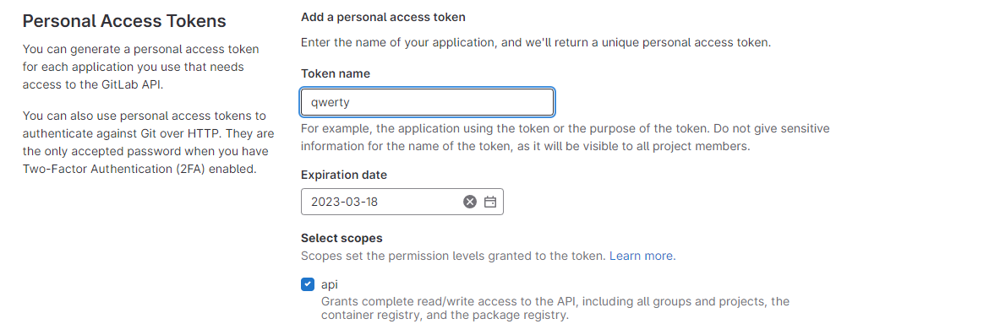
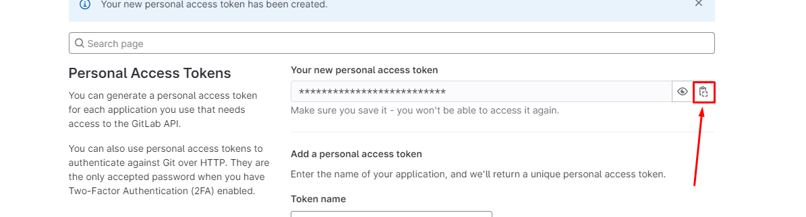
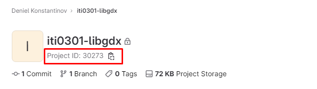

# Gitlab time tracking report

## Create access token

Go to Preferences > Access Tokens

https://gitlab.cs.ttu.ee/-/profile/personal_access_tokens

`Token: anything`

`Select scopes: api`

Copy the access token and paste it into the main.py file

## Generate time tracking report

Copy the project id from your GitLab repo and put it in the main.py file

Run the main.py file via PyCharm or the command line
`python main.py`

You will get a report in the format:
`{'Person': 'hh:mm:ss', 'Person2': 'hh:mm:ss'}`