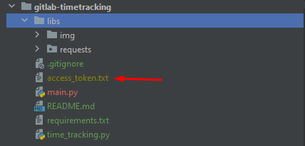

# Gitlab time tracking report

## Create access token

Go to Preferences > Access Tokens

https://gitlab.cs.ttu.ee/-/profile/personal_access_tokens

`Token: anything`

`Select scopes: api`

Copy access token 

Put it in access_token.txt file in main project folder

## Generate time tracking report

Copy project id from your GitLab repo and put it in main.py file

Run main.py file via PyCharm or command line
`python main.py`

You will get a report in format:
`{'Person': 'hh:mm:ss', 'Person2': 'hh:mm:ss'}`